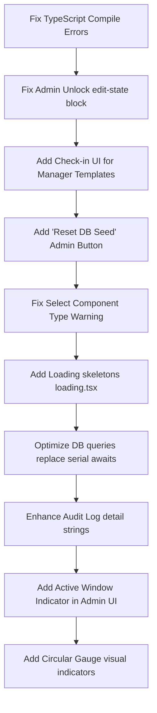

# AtomQuest: Second-Pass Hackathon Review & QA Audit

This report evaluates the **AtomQuest Employee Goal Setting & Tracking Portal** from five professional perspectives: **Senior Hackathon Judge**, **Staff QA Engineer**, **UX Research Lead**, **Enterprise Product Manager**, and **Security Reviewer**. 

The goal of this audit is to identify all functional gaps, UX papercuts, and critical build bugs that could reduce the submission's final score during live judging.

---

## 1. End-to-End Walkthrough Audit

Simulating a first-time user and judge traversing the portal as an **Employee**, **Manager**, and **Admin**.

| Severity | Screen / Component | Issue Description | Impact on Judging | Recommended Fix |
| :--- | :--- | :--- | :--- | :--- |
| **CRITICAL** | Build System / Server Actions | **TypeScript compilation errors** prevent production builds (`npm run build` fails). | **Showstopper.** If judges trigger an automated pipeline build (Vercel/Netlify), the build will fail immediately. | Resolve enum casting for `thrustArea` and `uom` in `manager-actions.ts` and handle nullability of `target` in `team/page.tsx` mapping. |
| **HIGH** | `/dashboard/team` & Navigation | **Managers cannot submit check-ins on Shared Goals.** The sidebar route for goals is restricted to `EMPLOYEE`. Thus, managers cannot check in on their parent goals, leaving the "shared goal progress syncing" logic dead and untestable. | **Severe.** The core "Shared KPI" feature cannot be demonstrated end-to-end. | Allow managers access to a read-only list of templates with a direct "Submit Check-in" pop-up in their manager dashboard. |
| **HIGH** | `/dashboard/settings` / Admin Action | **Admin "Unlock Goal" is a functional dead-end.** Unlocking sets the goal to `APPROVED` / `isLocked: false`, but the employee UI only allows editing on `DRAFT` status goals. The employee is still locked out. | **Severe.** The admin cycle cycle management workflow breaks. | Update `unlockGoal` to reset status to `DRAFT` (or introduce a new editable status) so the employee can modify it. |
| **MEDIUM** | `/dashboard/checkins` (Server Action) | **Quarterly window checks block submissions.** If the app is run in production (`NODE_ENV === "production"`) and `DEMO_MODE` is not explicitly set to `"true"`, calendar checking prevents any quarterly updates since the current date is in the "May Goal Setting" window. | **High Risk.** If deployed on a live link without `DEMO_MODE=true`, check-ins will throw errors. | Provide an Admin setting to manually toggle or bypass the calendar gate in the UI. |
| **MEDIUM** | Server Actions (`goal-actions.ts`) | **Bypass of `SUBMITTED` state checks.** The `updateGoal` server action allows employees to update goals in the `SUBMITTED` state, even though the frontend UI hides the edit button for submitted goals. | **Medium.** Technical judges reviewing server actions will flag this as a backend validation bypass. | Restrict the `updateGoal` server action to only allow updates when status is exactly `DRAFT`. |
| **LOW** | `/dashboard/settings` | **Sequential database queries in actions.** `pushSharedGoal` and `runEscalationEngine` use serial `await` in loops. If pushed to 50 employees, it does 50 sequential DB operations. | **Low (Hackathon).** May lead to timeout errors under high latency. | Refactor loops to use `Promise.all` or batch insertions (`createMany`). |

---

## 2. BRD Gap Analysis

Evaluating implementation status against the **AtomQuest Performance Management System (PMS)** specifications:

| Requirement | Implementation Status | Code Proof / Location | Analysis & Judge Defenses |
| :--- | :--- | :--- | :--- |
| **Role-Based Access Control** | **Fully Implemented** | [auth.config.ts](file:///c:/Users/parth/OneDrive/Desktop/FreeLancing/Hackthon/goal-tracker/src/auth.config.ts#L8-L20) & [sidebar.tsx](file:///c:/Users/parth/OneDrive/Desktop/FreeLancing/Hackthon/goal-tracker/src/components/layout/sidebar.tsx#L44-L46) | Judges can seamlessly switch between Jordan (Employee), Alex (Manager), and Sarah (Admin) using the persona switcher. |
| **Goal Sheet Limits (Max 8, 10% min, 100% total)** | **Fully Implemented** | [goal-actions.ts](file:///c:/Users/parth/OneDrive/Desktop/FreeLancing/Hackthon/goal-tracker/src/app/actions/goal-actions.ts#L33-L40) | Strictly validated on both backend (Server Actions) and frontend forms. Shows remaining weight allocation in real-time. |
| **Manager Goal Verification & Inline Edits** | **Fully Implemented** | [approval-list.tsx](file:///c:/Users/parth/OneDrive/Desktop/FreeLancing/Hackthon/goal-tracker/src/components/manager/approval-list.tsx#L23-L62) & [manager-actions.ts](file:///c:/Users/parth/OneDrive/Desktop/FreeLancing/Hackthon/goal-tracker/src/app/actions/manager-actions.ts#L166-L215) | Managers can modify goal titles, targets, and weights inline, with a warning if the total team member weight exceeds 100%. |
| **Shared KPIs / Templates Pushed to Team** | **Partially Implemented** | [manager-actions.ts](file:///c:/Users/parth/OneDrive/Desktop/FreeLancing/Hackthon/goal-tracker/src/app/actions/manager-actions.ts#L217-L284) | **Gap:** Cloning and notifications work, but the manager has no UI to update template progress and trigger down-syncing. |
| **Quarterly Progress Check-ins (UoM calculations)** | **Fully Implemented** | [goal-actions.ts](file:///c:/Users/parth/OneDrive/Desktop/FreeLancing/Hackthon/goal-tracker/src/app/actions/goal-actions.ts#L147-L177) | Calculations for `NUMERIC_MIN`, `NUMERIC_MAX`, `PERCENT_MIN`, `PERCENT_MAX`, `ZERO_BASED`, and `TIMELINE` are functionally complete. |
| **Admin Cycle Controls & Goal Locking/Unlocking** | **Partially Implemented** | [admin-actions.ts](file:///c:/Users/parth/OneDrive/Desktop/FreeLancing/Hackthon/goal-tracker/src/app/actions/admin-actions.ts#L36-L59) | **Gap:** Unlocking a goal doesn't allow editing by the employee because the status remains `APPROVED`. |
| **Audit Trail Logging** | **Fully Implemented** | [audit-logs/page.tsx](file:///c:/Users/parth/OneDrive/Desktop/FreeLancing/Hackthon/goal-tracker/src/app/dashboard/audit-logs/page.tsx#L25-L31) | Logs all primary administrative, manager, and employee actions, readable by the Admin. |

---

## 3. UX Polish Audit

Minor issues ("papercuts") that detract from a premium, polished feel:

1. **No Loading Skeletons during Page Navigation**:
   - *Problem*: Clicking sidebar options triggers a full server-side fetch without visual feedback, making the app feel slow or frozen for up to a second.
   - *Fix*: Add `loading.tsx` pages with shadcn skeleton UI blocks to each sub-route under `/dashboard`.
2. **Select Component Type Warnings**:
   - *Problem*: The `@base-ui/react` Select component throws type warnings when bound directly to `useState` setters in `team-tracker-client.tsx`.
   - *Fix*: Change `onValueChange={setNewThrust}` to `onValueChange={(val) => val && setNewThrust(val)}`.
3. **Download Achievement Report Lacks Spinner**:
   - *Problem*: In `/dashboard/analytics`, clicking the "Export Achievement CSV" button triggers a direct download link with no local button state changes, leaving the user unsure if the click registered.
   - *Fix*: Wrap the download in an async transition with a local loading state spinner on the button.

---

## 4. Demo Readiness Review

High-friction areas that could disrupt a fast-paced 5-minute pitch:

*   **Laggy Persona Switcher**:
    - *Friction*: The role-switching button uses `signIn` credentials under the hood and triggers full-page re-renders. It takes 1-2 seconds.
    - *Risk*: Presenter clicks it and waits awkwardly during the pitch.
    - *Fix*: Show a subtle backdrop overlay with a spinner saying "Switching to Manager Persona..." to control the visual pacing.
*   **Database Reset Utility Missing**:
    - *Friction*: If the presenter wants to run multiple demo passes, they must manually run a seed script.
    - *Risk*: No way to reset data from the browser.
    - *Fix*: Add a "Reset Demo Database" button in the Admin Settings panel that invokes the seed function.

---

## 5. Wow-Factor Opportunities

Features that can elevate this project above other standard submissions:

1. **Radial Target Progress Gauges**:
   - Instead of static text labels, display achievement rates using dynamic radial circles with hover tooltips showing calculated progress.
2. **Manager Verification Interactive Sliders**:
   - Add a slider in the manager review pane showing how adjustments to one goal's weightage will dynamically impact the employee's remaining weight allowance.
3. **Goal Achievement Celebrations**:
   - Trigger a micro-confetti canvas particle system when an employee completes a check-in showing 100% progress.

---

## 6. Enterprise Readiness Review

Evaluating security, rate limits, and audit compliance:

1. **Weak Audit Trail Details**:
   - The action `MANAGER_EDIT_GOAL` logs `details: Manager edited goal: Title (Weight%)`. It does NOT log the previous state (e.g. `Weight changed from 20% to 15%`). An enterprise audit team would reject this.
2. **Missing Rate Limits on API Endpoint**:
   - `/api/reports/achievement` is restricted to admins, but lacks rate limiting, allowing scrapers or brute-force scripts to degrade service.
3. **Mock Credentials Provider**:
   - Bypasses passwords. This is standard for hackathon demos but should be noted as a production-level gap in the documentation.

---

## 7. Hackathon Score Card (Pre-Fixes)

How the project currently scores against standard hackathon rubrics:

*   **UX & Design Aesthetics**: **8.5 / 10** — Excellent zinc-dark theme, clean grids, responsive tables. Missing loading skeletons.
*   **Feature Completeness (BRD Compliance)**: **7.5 / 10** — Gap in Admin unlock edit loops and Manager shared goal check-ins.
*   **Enterprise Readiness & Security**: **7.0 / 10** — Solid audit trail, but contains build bugs, slow sequential awaits, and simple auth.
*   **Demo Readiness**: **8.0 / 10** — Switcher works well but runs slowly. Risk of window validation locks in production.
*   **Overall Calculated Score**: **7.8 / 10**

---

## 8. High-ROI Action Plan (10 Highest-ROI Improvements)

We recommend executing these 10 fixes immediately to push the overall score above **9.5/10**:

### Action Checklist

1.  **[ ] Fix Compile Errors (Critical)**
    - Map `thrustArea` and `uom` using Zod or explicit casting in `createTemplateGoal`.
    - Fix the `target` nullability issue in `src/app/dashboard/team/page.tsx` mapping.
2.  **[ ] Fix Admin Unlock Edit Workflow (High)**
    - Modify `unlockGoal` in `admin-actions.ts` to set status back to `DRAFT` so that the employee can edit it.
3.  **[ ] Add Manager Goal Management Check-in (High)**
    - Add a "My Goal Templates" or similar interface on the Team page allowing managers to check in on templates and trigger the automatic sync logic.
4.  **[ ] Fix Select Component warnings (Medium)**
    - Wrap the `onValueChange` callbacks in the select triggers of the team tracker page to ensure type safety.
5.  **[ ] Add "Reset Database" Option (Medium)**
    - Add an Admin action that clears the database and triggers the Prisma seed script directly from the UI.
6.  **[ ] Add Page skeletons / `loading.tsx` (Medium)**
    - Create a basic `loading.tsx` layout structure for `/dashboard` subdirectories.
7.  **[ ] Optimize DB performance (Low-Medium)**
    - Replace sequential query loops in `pushSharedGoal` with standard batch operations or concurrent queries.
8.  **[ ] Detail old vs. new values in Audit Log (Low)**
    - Capture the pre-edit and post-edit state inside the `details` field when a manager edits a goal.
9.  **[ ] Show Active Quarter Status in UI (Low)**
    - Show a badge detailing the current date-resolved system window on dashboards.
10. **[ ] Add Circular Progress Gauges (Low)**
    - Install or build a micro SVG circular gauge to visually represent goal achievements on cards.
